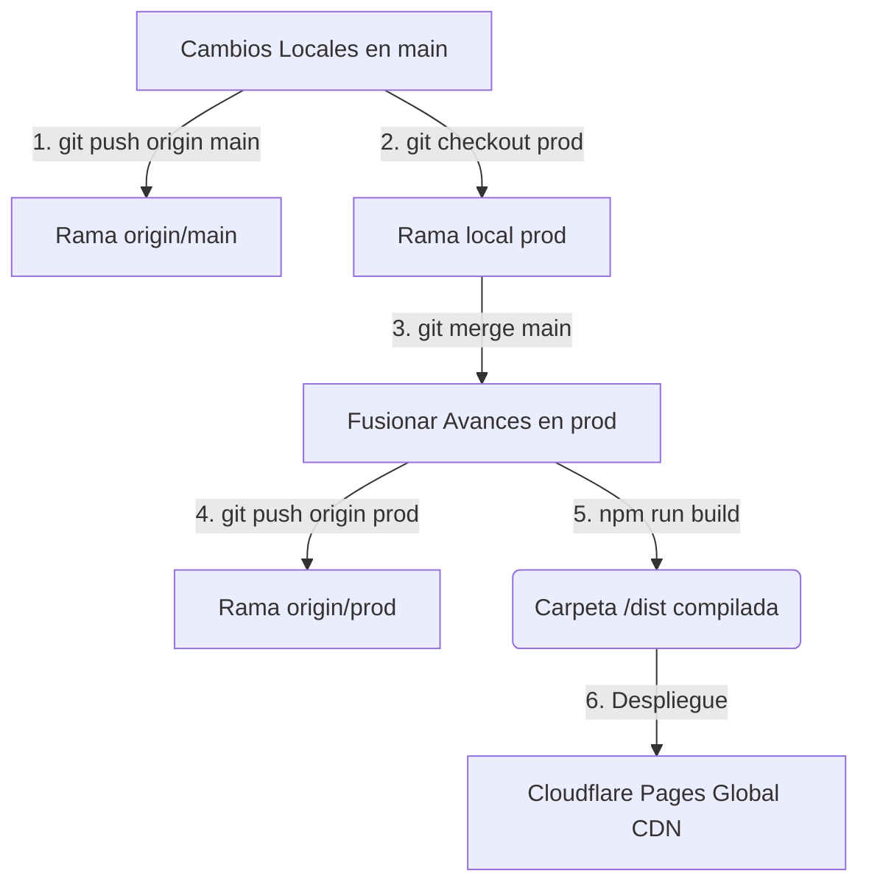

# Guía de Despliegue Genérico y Gestión de Ramas (Deployment Skill) - dShopping Lite

Este documento detalla la metodología de integración continua, el control de ramas, la configuración y los pasos operativos para sincronizar, compilar e implementar **dShopping Lite** (o cualquier proyecto SPA Vite compatible) utilizando las ramas de control **`main`** y **`prod`** con el repositorio remoto **`origin`**.

---

## 1. Arquitectura del Flujo de Trabajo (Git Workflow)

Para garantizar la estabilidad del software y aislar el desarrollo activo de la versión de producción, la arquitectura de despliegue se organiza bajo un flujo de dos ramas principales sincronizadas con el servidor central `origin`:



### Roles de las Ramas:
*   **`main`**: Rama de desarrollo activo. Aquí se implementan y testean las nuevas características y correcciones de errores. Siempre es el punto de partida del desarrollo diario.
*   **`prod`**: Rama de estabilidad de producción. Solo recibe código verificado proveniente de `main` mediante fusiones automáticas o manuales (`git merge`). Es la rama vinculada al entorno público.
*   **`origin`**: Repositorio remoto centralizado (ej. GitHub) que actúa como la fuente de verdad de ambas ramas.

---

## 2. Utilidad de Automatización Local (`scripts/deploy.ps1`)

Para facilitar este ciclo a los desarrolladores en sistemas Windows, se incluye un script en PowerShell de carácter genérico y altamente interactivo en [scripts/deploy.ps1](file:///c:/Users/DELL/Documents/dPana%20Projects/dPana%20Compras/scripts/deploy.ps1).

### Cómo ejecutar la herramienta:
1. Abra su consola de **PowerShell** en Windows.
2. Navegue hasta la raíz de su proyecto:
   ```powershell
   cd "C:\Users\DELL\Documents\dPana Projects\dPana Compras"
   ```
3. Ejecute la utilidad:
   ```powershell
   .\scripts\deploy.ps1
   ```

### Menú de Opciones Disponibles:
Al iniciar, la herramienta analiza de manera transparente su configuración de Git local, verifica si existen archivos sin confirmar para prevenir pérdidas accidentales de código, y le ofrece tres flujos de trabajo clave:

#### Opción 1: Ciclo Completo (Git Sync + Compilación + Despliegue)
*   **Ideal para**: Lanzamiento de nuevas versiones desde `main`.
*   **Qué hace**: 
    1. Empuja la rama de desarrollo activa hacia `origin/main`.
    2. Cambia automáticamente el espacio de trabajo local a la rama `prod`.
    3. Trae actualizaciones de `origin/prod` y realiza el *merge* de `main` de manera limpia.
    4. Empuja la rama consolidada a `origin/prod`.
    5. Ejecuta la compilación de producción (`npm run build`).
    6. Despliega la carpeta de distribución (`dist/`) hacia Cloudflare Pages mediante Wrangler (solicitando inicio de sesión en navegador o cargando su token).
    7. Restaura su terminal a la rama local `main` para que continúe trabajando sin interrupciones.

#### Opción 2: Solo Sincronización Git (Git Sync)
*   **Ideal para**: Sincronizar y alinear las ramas `main` y `prod` en el servidor remoto `origin` sin necesidad de generar compilados locales ni subir archivos al hosting.
*   **Qué hace**: Realiza de forma secuencial todo el flujo de branches descrito en la opción 1 (push main -> checkout prod -> merge main -> push prod -> checkout main) y finaliza con éxito.

#### Opción 3: Solo Despliegue Local (Compilar y Desplegar)
*   **Ideal para**: Pruebas rápidas en caliente o despliegues locales urgentes cuando no se desea alterar el estado de las ramas Git en `origin`.
*   **Qué hace**: Compila localmente el código actual mediante Vite y activa Wrangler para subir el directorio compilado de manera inmediata al hosting.

---

## 3. Variables de Entorno del Proyecto

Cualquier proyecto SPA estático requiere la inyección de sus variables operativas en el hosting antes de la compilación. Para **dShopping Lite**, asegúrese de configurar las siguientes variables en el panel de su proveedor (Settings -> Environment variables en Cloudflare Pages):

| Variable de Entorno | Tipo | Propósito |
|---------------------|------|-----------|
| `VITE_SUPABASE_URL` | URL | Endpoint API de su proyecto Supabase. |
| `VITE_SUPABASE_ANON_KEY` | JWT Key | Clave pública anónima de acceso seguro con RLS. |

---

## 4. Despliegue Automatizado en CI/CD (GitHub Actions)

Si prefiere automatizar completamente el despliegue al momento de empujar código a `origin/prod` a través de GitHub, puede agregar un flujo de integración continua en su repositorio creando el archivo `.github/workflows/deploy.yml`:

```yaml
name: Deploy SPA Application

on:
  push:
    branches:
      - prod # Gatilla el despliegue automático cuando se empuja a esta rama

jobs:
  deploy:
    runs-on: ubuntu-latest
    steps:
      - name: Checkout Code
        uses: actions/checkout@v4

      - name: Install Node.js
        uses: actions/setup-node@v4
        with:
          node-version: '20'
          cache: 'npm'

      - name: Install Dependencies
        run: npm ci

      - name: Compile and Build Bundle
        env:
          VITE_SUPABASE_URL: ${{ secrets.VITE_SUPABASE_URL }}
          VITE_SUPABASE_ANON_KEY: ${{ secrets.VITE_SUPABASE_ANON_KEY }}
        run: npm run build

      - name: Deploy to Cloudflare Pages
        uses: cloudflare/wrangler-action@v3
        with:
          apiToken: ${{ secrets.CLOUDFLARE_API_TOKEN }}
          accountId: ${{ secrets.CLOUDFLARE_ACCOUNT_ID }}
          command: pages deploy dist --project-name=dshopping-lite
```

---

## 5. Resolución de Problemas y Diagnóstico (Troubleshooting)

*   **Conflictos de Git durante el Merge**:
    *   *Síntoma*: El script se detiene en el paso de fusión indicando que hay conflictos.
    *   *Solución*: Abra su editor de código, resuelva los bloques de conflicto manualmente en la rama `prod`, confirme los cambios con `git commit`, y luego puede ejecutar la **Opción 3** del script para completar el despliegue del código reparado.
*   **Error de Permiso de Ejecución de Scripts en PowerShell**:
    *   *Síntoma*: PowerShell indica que la ejecución de scripts está deshabilitada en el sistema.
    *   *Solución*: Abra PowerShell como Administrador y habilite la ejecución local mediante el comando:
        ```powershell
        Set-ExecutionPolicy -ExecutionPolicy RemoteSigned -Scope LocalMachine
        ```
*   **Rollback de Emergencia**:
    *   Si se despliega una versión inestable en producción, inicie sesión en el dashboard de Cloudflare Pages, ingrese a su proyecto, navegue a **Deployments**, busque la versión previa que operaba correctamente, haga clic en los tres puntos y seleccione **Rollback to this deployment**. El tráfico global retornará a dicho bundle en menos de 2 segundos.
