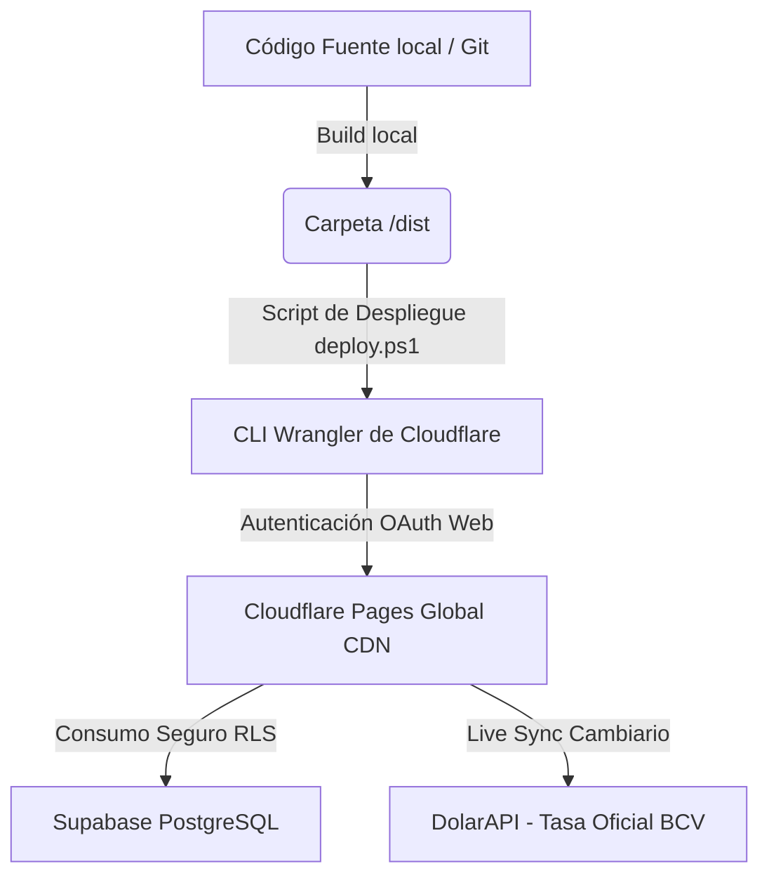

# Guía de Despliegue (Deployment Skill) - dShopping Lite

Este documento detalla la metodología, configuración y los pasos operativos para compilar e implementar **dShopping Lite** en entornos de producción y pruebas utilizando **Cloudflare Pages**.

---

## 1. Arquitectura de Despliegue
**dShopping Lite** es una aplicación de página única (SPA) compilada sobre **Vite** y **TypeScript**. Debido a que todo el procesamiento contable, exportación y conversión cambiaria ocurre en el navegador del cliente mediante integraciones directas con **Supabase** y la API oficial del **BCV**, el hosting idóneo es un proveedor de hosting estático global de baja latencia como **Cloudflare Pages**.



---

## 2. Variables de Entorno Requeridas
Para que la aplicación funcione correctamente tras el despliegue, se deben configurar las siguientes variables de entorno en el panel de Cloudflare Pages o en el archivo local `.env`:

| Variable de Entorno | Tipo | Descripción | Ejemplo de Valor |
|---------------------|------|-------------|------------------|
| `VITE_SUPABASE_URL` | String (URL) | Endpoint de conexión a la API REST de su proyecto Supabase. | `https://xxxxxx.supabase.co` |
| `VITE_SUPABASE_ANON_KEY` | String (JWT) | Clave pública anónima de Supabase que valida políticas RLS. | `eyJhbGciOiJIUzI1NiIsInR5cCI6IkpXVCJ9...` |

> [!IMPORTANT]
> **Seguridad**: Nunca publique ni exponga en el repositorio claves del rol de administrador (`service_role` o `master_key`). La clave `VITE_SUPABASE_ANON_KEY` es totalmente segura para ser servida al cliente ya que todas las tablas están protegidas por **RLS (Seguridad a Nivel de Fila)** en Supabase.

---

## 3. Despliegue Local Interactivo (Windows PowerShell)

Dado que las herramientas de automatización en la nube o terminales sandboxed no permiten la redirección a navegadores web para completar la autenticación interactiva (OAuth) de Cloudflare, la mejor forma de desplegar manualmente es mediante la utilidad PowerShell incorporada en el proyecto.

### Pasos para desplegar:
1. Abra una consola de **PowerShell** en su computadora host.
2. Navegue al directorio raíz del proyecto:
   ```powershell
   cd "C:\Users\DELL\Documents\dPana Projects\dPana Compras"
   ```
3. Ejecute el script de despliegue automatizado:
   ```powershell
   .\scripts\deploy.ps1
   ```
4. El script realizará las siguientes acciones:
   - Verificará la estructura del proyecto.
   - Compilará la versión de producción (`npm run build`), ejecutando validaciones estrictas de TypeScript.
   - Validará la creación del directorio `dist/`.
   - Le ofrecerá usar un token estático o abrirá una ventana de su navegador para autenticar su cuenta de Cloudflare de forma 100% segura.
   - Desplegará la compilación a Cloudflare Pages de inmediato.

---

## 4. Despliegue Automatizado en CI/CD (GitHub Actions)

Para implementar integración continua (CI/CD) de modo que cada commit en la rama de producción (`prod`) se despliegue automáticamente sin necesidad de scripts manuales:

1. **Obtener un Token de API de Cloudflare**:
   - Vaya a su Dashboard de Cloudflare -> *Mi perfil* -> *Tokens de API* -> *Crear Token*.
   - Use la plantilla **Editar Cloudflare Pages**.
   - Copie el token generado.

2. **Configurar Secretos en GitHub**:
   - En su repositorio en GitHub, vaya a *Settings* -> *Secrets and variables* -> *Actions*.
   - Agregue un nuevo secreto con nombre `CLOUDFLARE_API_TOKEN` y pegue su token de Cloudflare.
   - Agregue un secreto con nombre `CLOUDFLARE_ACCOUNT_ID` con el ID de su cuenta (visible en la barra lateral del panel de Cloudflare).

3. **Crear Archivo de Workflow**:
   Cree un archivo en `.github/workflows/deploy.yml` con el siguiente contenido:

```yaml
name: Deploy dShopping Lite

on:
  push:
    branches:
      - prod # Despliega automáticamente al empujar a esta rama

jobs:
  deploy:
    runs-on: ubuntu-latest
    steps:
      - name: Checkout Code
        uses: actions/checkout@v4

      - name: Install Node.js
        uses: actions/setup-node@v4
        with:
          node-node: '20'
          cache: 'npm'

      - name: Install Dependencies
        run: npm ci

      - name: Compile and Build Bundle
        env:
          VITE_SUPABASE_URL: ${{ secrets.VITE_SUPABASE_URL }}
          VITE_SUPABASE_ANON_KEY: ${{ secrets.VITE_SUPABASE_ANON_KEY }}
        run: npm run build

      - name: Deploy to Cloudflare Pages
        uses: cloudflare/wrangler-action@v3
        with:
          apiToken: ${{ secrets.CLOUDFLARE_API_TOKEN }}
          accountId: ${{ secrets.CLOUDFLARE_ACCOUNT_ID }}
          command: pages deploy dist --project-name=dshopping-lite
```

---

## 5. Resolución de Problemas Comunes (Troubleshooting)

### Error: `In a non-interactive environment, it's necessary to set a CLOUDFLARE_API_TOKEN`
* **Causa**: Intentó ejecutar `npx wrangler pages deploy` directamente desde una consola no interactiva o virtualizada.
* **Solución**: Ejecute el script local interactivo `.\scripts\deploy.ps1` en su terminal de Windows nativa. De este modo, Wrangler podrá abrir su navegador web predeterminado para otorgar los permisos de inicio de sesión de forma segura y automatizada.

### Error: `Build failed: tsc && vite build`
* **Causa**: Errores de compilación de TypeScript o importaciones rotas en el código de frontend.
* **Solución**: Corrija las inconsistencias de tipos reportadas en la consola antes de reintentar. Puede ejecutar localmente `npx tsc` para aislar los problemas de tipado sin necesidad de compilar todo el bundle.

### Los datos de Supabase no cargan tras el despliegue
* **Causa**: Falta configurar las variables de entorno `VITE_SUPABASE_URL` y `VITE_SUPABASE_ANON_KEY` en el dashboard de Cloudflare Pages.
* **Solución**: 
  1. Inicie sesión en Cloudflare.
  2. Vaya a *Workers & Pages* -> *dshopping-lite* -> *Settings* -> *Environment variables*.
  3. Agregue ambas variables bajo la sección de **Production** y **Preview**.
  4. Redespliegue el proyecto para que los valores sean inyectados en el bundle.

---

## 6. Procedimiento de Rollback (Reversión Instantánea)
Si un despliegue presenta problemas críticos en producción, Cloudflare Pages le permite revertir a una compilación previa de forma instantánea y sin compilar código:

1. Inicie sesión en **Cloudflare**.
2. Vaya a **Workers & Pages** y seleccione **dshopping-lite**.
3. En la pestaña **Deployments**, localice el listado de versiones históricas desplegadas.
4. Identifique la última versión estable (con estado de éxito anterior).
5. Haga clic en los tres puntos `...` a la derecha de esa versión y elija **Rollback to this deployment** (o *Establecer como activa*).
6. Cloudflare redirigirá el tráfico global a dicho bundle estático anterior en menos de 2 segundos.
