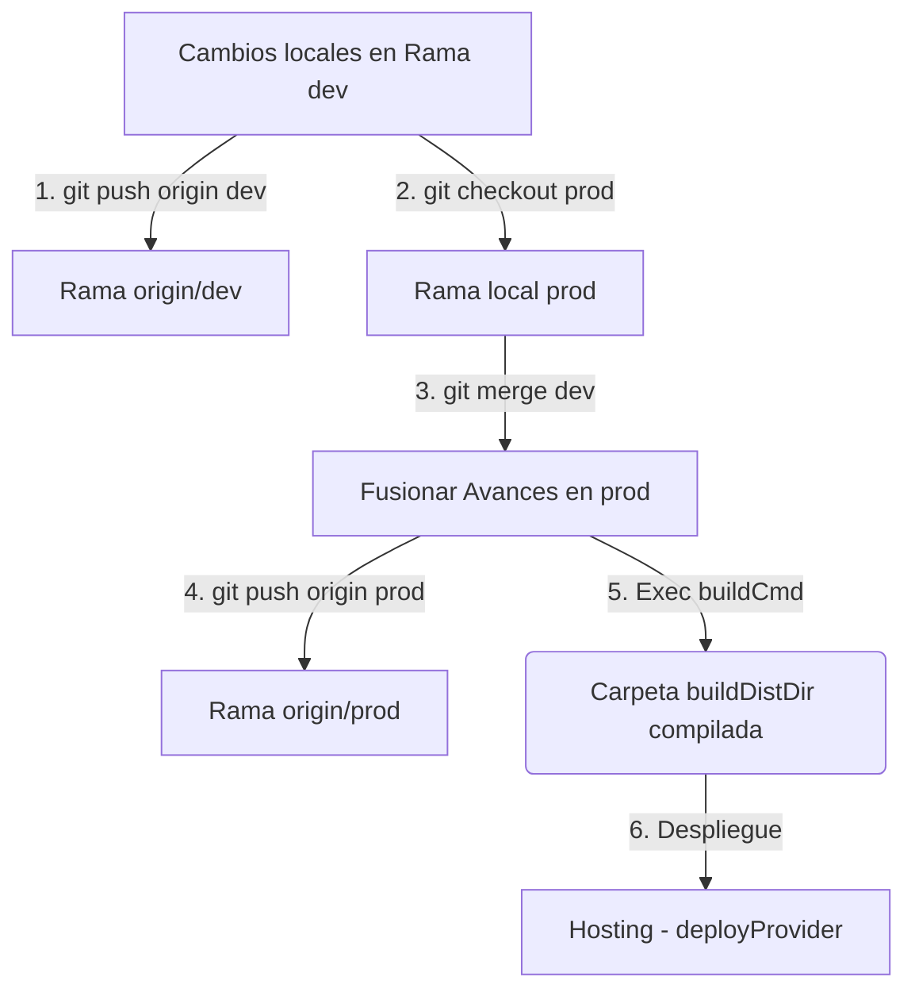

# Guía de Despliegue Agnostico y Gestión de Ramas (Agnostic Deployment Skill)

Este documento detalla la metodología de integración continua, el control de ramas y los pasos operativos del **Desplegador Agnostico y Sincronizador de Ramas**. 

Esta suite está diseñada para ser **100% modular y reutilizable**. Puede copiar la carpeta `scripts/` y esta guía en **cualquier proyecto web** (React, Vite, Vue, Angular, Svelte, Next.js estático, o HTML/JS plano) para gestionar de forma automatizada las ramas Git, la compilación y la subida de archivos a su hosting.

---

## 1. El Motor de Configuración Agnostica (`deploy.config.json`)

Toda la lógica de ejecución del script está desacoplada del código fuente y se gestiona dinámicamente mediante el archivo [deploy.config.json](file:///c:/Users/DELL/Documents/dPana%20Projects/dPana%20Compras/deploy.config.json) en la raíz de su espacio de trabajo.

### Esquema y Parámetros del JSON:
```json
{
  "projectName": "dShopping Lite",
  "buildCmd": "npm run build",
  "buildDistDir": "dist",
  "remote": "origin",
  "branches": {
    "dev": "main",
    "prod": "prod"
  },
  "deployProvider": "cloudflare",
  "cloudflare": {
    "projectName": "dshopping-lite"
  },
  "customDeployCmd": "npx wrangler pages deploy dist --project-name=dshopping-lite"
}
```

*   **`projectName`**: Nombre del proyecto a mostrar en la interfaz interactiva de la consola.
*   **`buildCmd`**: Comando exacto de consola utilizado para compilar su aplicación (ej. `npm run build`, `npm run generate`, `vite build`, `tsc && vite build`).
*   **`buildDistDir`**: Ruta relativa a la carpeta de salida generada tras la compilación (ej. `dist`, `build`, `out`, `public`).
*   **`remote`**: Nombre del servidor remoto Git configurado en su proyecto (por defecto `origin`).
*   **`branches`**:
    *   **`dev`**: Nombre de su rama de desarrollo activa (ej. `main`, `master`, `dev`, `develop`).
    *   **`prod`**: Nombre de su rama de producción estable (ej. `prod`, `production`, `release`).
*   **`deployProvider`**: Plataforma de hosting de destino. Admite:
    *   `"cloudflare"`: Activa el despliegue nativo mediante Wrangler para Cloudflare Pages utilizando los datos del objeto `"cloudflare"`.
    *   `"custom"`: Ejecuta cualquier script o comando CLI personalizado definido en `"customDeployCmd"`.
    *   `"none"`: Sincroniza las ramas en Git y compila el bundle local, pero omite la fase de subida a la nube.
*   **`customDeployCmd`**: Comando personalizado de terminal si selecciona el proveedor `"custom"` (ej. `firebase deploy`, `vercel --prod`, `netlify deploy --dir=dist --prod`).

---

## 2. Flujo de Trabajo y Ramas Dinámicas

Al ejecutar el script, toda la lógica de control de ramas de Git se adapta dinámicamente a las definidas en su archivo de configuración:



---

## 3. Instrucciones de Uso Local (Windows PowerShell)

1. Abra una consola de **PowerShell** en Windows.
2. Navegue al directorio raíz del proyecto:
   ```powershell
   cd "C:\path\to\your\any-web-project"
   ```
3. Ejecute el script:
   ```powershell
   .\scripts\deploy.ps1
   ```

### Flujo de Autogeneración Automática:
Si copia el script `deploy.ps1` en un nuevo proyecto que **no** tiene un archivo de configuración:
1. El script detectará la ausencia de `deploy.config.json`.
2. Leerá la propiedad `name` dentro de su `package.json` local (si existe).
3. Generará un archivo `deploy.config.json` pre-rellenado con valores por defecto óptimos de inmediato.
4. Podrá editar este archivo JSON en cualquier momento para adaptarlo a su infraestructura de hosting sin tocar una sola línea de código en el script.

---

## 4. Opciones del Menú de Despliegue

La terminal interactiva le presentará el siguiente menú de decisiones adaptadas a su proyecto:

*   **`[1] Ciclo Completo`**: Sincroniza su rama de desarrollo con `origin`, se cambia a producción, fusiona los avances locales, empuja la rama a `origin`, ejecuta su comando de compilación (`buildCmd`) y realiza la subida de los archivos de su directorio de distribución al proveedor de hosting configurado. Finalmente, le regresa automáticamente a su rama de desarrollo para resguardar su estado de trabajo.
*   **`[2] Solo Sincronización Git`**: Ejecuta únicamente el flujo de fusión y alineación de ramas locales y remotas en `origin`. Ideal para sincronizar repositorios sin desplegar.
*   **`[3] Solo Despliegue Local`**: Compila su aplicación local y la despliega directamente en el hosting. Ideal para realizar pruebas rápidas y *hotfixes* locales sin ensuciar el historial de Git.

---

## 5. Integración con CI/CD (GitHub Actions)

Para configurar la integración continua genérica mediante GitHub Actions utilizando su archivo de configuración:

1. Agregue sus variables y claves de hosting como secretos en el repositorio en GitHub (`Settings -> Secrets and variables -> Actions`).
2. Cree el flujo de trabajo en `.github/workflows/deploy.yml`:

```yaml
name: Agnostic Deploy Pipeline

on:
  push:
    branches:
      - prod # Reemplace con el nombre de su rama de producción

jobs:
  deploy:
    runs-on: ubuntu-latest
    steps:
      - name: Checkout Code
        uses: actions/checkout@v4

      - name: Install Node.js
        uses: actions/setup-node@v4
        with:
          node-version: '20'
          cache: 'npm'

      - name: Install Dependencies
        run: npm ci

      - name: Compile and Build
        run: npm run build # Reemplace con su comando de compilación configurado

      - name: Deploy to Cloudflare Pages
        uses: cloudflare/wrangler-action@v3
        with:
          apiToken: ${{ secrets.CLOUDFLARE_API_TOKEN }}
          accountId: ${{ secrets.CLOUDFLARE_ACCOUNT_ID }}
          command: pages deploy dist --project-name=dshopping-lite
```
