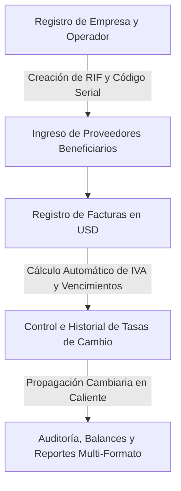
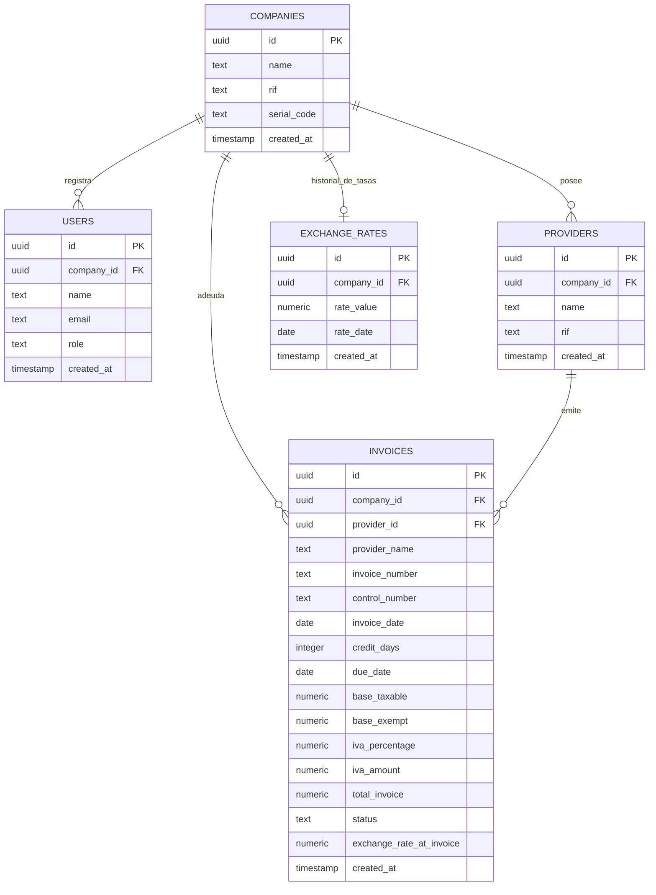

# Informe Corporativo Ejecutivo: dShopping Lite
## Sistema de Gestión de Cuentas por Pagar y Control Cambiario Inteligente

---

### Resumen Ejecutivo

En el entorno macroeconómico actual, la administración corporativa de cuentas por pagar se enfrenta a un desafío crítico: la fluctuación y devaluación constante de la moneda local en relación con divisas fuertes como el Dólar Americano (USD). La disparidad entre el momento de registro de una obligación financiera y su fecha de pago efectivo genera distorsiones contables y pérdidas en el flujo de caja si no se cuenta con una trazabilidad precisa.

**dShopping Lite** nace como una solución de software empresarial de alto rendimiento diseñada para resolver de manera atómica este problema. La plataforma consolida un control contable multi-empresa aislado, permitiendo el registro de obligaciones en dólares, la facturación bajo parámetros fiscales locales, y una conversión cambiaria dinámica y reactiva sincronizada en tiempo real con las tasas oficiales del Banco Central de Venezuela (BCV).

---

## 1. Funcionamiento del Sistema y Flujo de Negocio

El sistema opera bajo una arquitectura estructurada orientada al usuario administrador y operador contable, dividida en cuatro macro-procesos:



### Flujo Operativo:
1.  **Registro y Aislamiento Fiscal**: Cada corporación se registra mediante su **RIF (Registro de Información Fiscal)** único. El sistema autogenera un *Código Serial Corporativo* de 8 dígitos que permite vincular operadores autorizados de forma segura, garantizando el aislamiento absoluto de los datos contables.
2.  **Gestión de Obligaciones (Cuentas por Pagar)**: Los operadores alimentan el sistema ingresando facturas en dólares de sus proveedores. El sistema calcula de forma instantánea el Subtotal Imponible, el Monto Exento, el porcentaje aplicable de IVA, y la fecha de vencimiento basándose en los días de crédito otorgados.
3.  **Bolívar Live Sync (Control Cambiario)**: La aplicación integra un actualizador dinámico que recupera el tipo de cambio oficial promedio de la API del BCV con un solo clic. Al actualizarse la tasa cambiaria, el sistema propaga el nuevo valor actualizando la base de datos y recalculando al instante todos los saldos pendientes y equivalencias en bolívares (Bs.) de forma reactiva en la pantalla.
4.  **Consolidación y Auditoría**: El módulo de reportes consolida los balances acumulados de facturas pendientes y pagadas, permitiendo exportar estados financieros tabulares a formatos físicos o digitales ejecutivos.

---

## 2. Características Principales de Negocio

> [!NOTE]
> La aplicación está diseñada bajo el estándar de accesibilidad **WCAG AA** utilizando variables de color modernas en el espacio de color **HSL/OKLCH** con transiciones de interfaz suaves para disminuir la fatiga operativa del personal de contabilidad.

*   **Sincronización Cambiaria en Caliente (Live Rate Sync)**: Eliminación del error humano y discrepancias cambiarias. Al cambiar la tasa cambiaria del día, se ejecuta una actualización masiva en la base de datos que modifica la tasa de facturas no liquidadas para reflejar saldos reales en bolívares.
*   **Vista Previa de Impresión HTML de Alta Fidelidad**: Emulación exacta en pantalla de una hoja Carta (Letter) física, desglosando la estructura tributaria y financiera corporativa. El sistema aisla el comprobante mediante reglas CSS de impresión (`@media print`) para evitar clippings y recortar elementos innecesarios del navegador al momento de imprimir físicamente (`window.print()`).
*   **Exportación Multipropósito Premium**:
    *   **Excel de Alta Fidelidad (.xlsx)**: Generación directa en cliente de libros de trabajo binarios reales de Excel (no CSV planos) con autoajuste del ancho de columnas y tipos de datos numéricos estrictos legibles por Microsoft Excel o Google Sheets.
    *   **Reportes PDF Consolidados**: Generación de reportes financieros tabulares horizontales con membrete y resúmenes ejecutivos automatizados utilizando la librería `jsPDF` y `jspdf-autotable`.
    *   **Comprobante PDF Individual**: Descarga instantánea de la factura de manera local en un formato Letter limpio con un diseño de membrete violeta corporativo para archivo contable.
*   **Notificaciones Interactivas Integradas**: Sustitución de alertas tradicionales del navegador por diálogos modales e informativos dinámicos de **SweetAlert2** adaptados al tema de contraste de la aplicación.

---

## 3. Arquitectura de la Base de Datos (Esquema Supabase)

El backend de la plataforma se apoya en **Supabase** corriendo sobre un motor **PostgreSQL** relacional robusto. La integridad referencial y las relaciones lógicas están modeladas a nivel de base de datos para impedir cualquier fuga o inconsistencia.

### Diagrama Entidad-Relación (DER)



---

## 4. Diccionario de Datos Detallado

A continuación se documentan los tipos de datos, restricciones y propósitos de negocio de cada entidad física implementada en la base de datos:

### Tabla: `companies`
Almacena la información de las corporaciones activas afiliadas al sistema.

| Columna | Tipo | Restricciones | Propósito de Negocio |
|---------|------|---------------|----------------------|
| `id` | `uuid` | PK, Default `gen_random_uuid()` | Identificador universal único de la empresa. |
| `name` | `text` | NOT NULL | Razón social o nombre legal de la corporación. |
| `rif` | `text` | NOT NULL, UNIQUE | Identificación fiscal (ej. J-12345678-9). |
| `serial_code` | `text` | NOT NULL, UNIQUE | Código aleatorio de vinculación para operadores. |
| `created_at` | `timestamptz` | Default `now()` | Fecha y hora de registro de la organización. |

---

### Tabla: `users`
Almacena la identidad de los operadores y administradores vinculados a cada empresa.

| Columna | Tipo | Restricciones | Propósito de Negocio |
|---------|------|---------------|----------------------|
| `id` | `uuid` | PK (Mapeado a `auth.users`) | ID de autenticación de Supabase Auth. |
| `company_id` | `uuid` | FK -> `companies.id` | Empresa a la cual pertenece y restringe su acceso. |
| `name` | `text` | NOT NULL | Nombre completo del operador. |
| `email` | `text` | NOT NULL, UNIQUE | Correo electrónico de acceso. |
| `role` | `text` | Default `'operator'` | Nivel de permiso ('admin' \| 'operator'). |
| `created_at` | `timestamptz` | Default `now()` | Fecha de registro del perfil de usuario. |

---

### Tabla: `providers`
Catálogo de proveedores o beneficiarios de pagos registrados por empresa.

| Columna | Tipo | Restricciones | Propósito de Negocio |
|---------|------|---------------|----------------------|
| `id` | `uuid` | PK, Default `gen_random_uuid()` | ID único del proveedor. |
| `company_id` | `uuid` | FK -> `companies.id` | Vinculación y seguridad multi-empresa. |
| `name` | `text` | NOT NULL | Nombre o razón social del proveedor. |
| `rif` | `text` | NOT NULL | Identificación fiscal única del proveedor. |
| `created_at` | `timestamptz` | Default `now()` | Fecha de registro en el catálogo de compras. |

---

### Tabla: `invoices`
Registro atómico de obligaciones contables y desglose fiscal de facturas.

| Columna | Tipo | Restricciones | Propósito de Negocio |
|---------|------|---------------|----------------------|
| `id` | `uuid` | PK, Default `gen_random_uuid()` | ID de transacción de la factura. |
| `company_id` | `uuid` | FK -> `companies.id` | Vinculación y seguridad multi-empresa. |
| `provider_id` | `uuid` | FK -> `providers.id` | Proveedor beneficiario asociado. |
| `provider_name` | `text` | NOT NULL | Copia del nombre del proveedor (desnormalización de lectura rápida). |
| `invoice_number`| `text` | NOT NULL | Número correlativo físico de la factura. |
| `control_number`| `text` | NOT NULL | Número de control fiscal asignado por la imprenta. |
| `invoice_date` | `date` | NOT NULL | Fecha de emisión de la factura. |
| `credit_days` | `integer` | Default `0` | Días de crédito otorgados para el pago. |
| `due_date` | `date` | NOT NULL | Fecha límite calculada (`invoice_date + credit_days`). |
| `base_taxable` | `numeric` | NOT NULL | Base imponible afecta a IVA (USD). |
| `base_exempt` | `numeric` | NOT NULL | Base exenta o no gravada (USD). |
| `iva_percentage`| `numeric` | NOT NULL, Default `16.0` | Porcentaje de impuesto aplicable (ej. 16%). |
| `iva_amount` | `numeric` | NOT NULL | Monto del IVA calculado (`base_taxable * iva_percentage`). |
| `total_invoice` | `numeric` | NOT NULL | Sumatoria contable (`base_taxable + base_exempt + iva_amount`). |
| `status` | `text` | Default `'pending'` | Estado de la cuenta ('pending' \| 'paid'). |
| `exchange_rate_at_invoice` | `numeric` | NOT NULL | Tasa de cambio cambiaria del Bolívar al momento del registro. |
| `created_at` | `timestamptz` | Default `now()` | Marca de tiempo transaccional. |

---

### Tabla: `exchange_rates`
Almacena el historial y la tasa de cambio activa diaria.

| Columna | Tipo | Restricciones | Propósito de Negocio |
|---------|------|---------------|----------------------|
| `id` | `uuid` | PK, Default `gen_random_uuid()` | ID único del registro cambiario. |
| `company_id` | `uuid` | FK -> `companies.id` | Vinculación y seguridad multi-empresa. |
| `rate_value` | `numeric` | NOT NULL | Tipo de cambio en Bolívares por Dólar (Bs./USD). |
| `rate_date` | `date` | NOT NULL, Default `CURRENT_DATE` | Fecha de vigencia de la tasa cambiaria. |
| `created_at` | `timestamptz` | Default `now()` | Fecha y hora de guardado de la tasa. |

---

## 5. Políticas de Seguridad de Datos (Seguridad Core - RLS)

> [!CAUTION]
> En aplicaciones financieras multi-empresa, la seguridad es crítica. Un error que permita filtrar facturas de una empresa a los operadores de otra podría constituir una grave violación de secreto fiscal y confidencialidad.

Para mitigar este riesgo de forma robusta, **dShopping Lite** no delega la seguridad únicamente al código cliente. Toda la seguridad está anclada a nivel del motor PostgreSQL mediante **RLS (Row-Level Security / Seguridad a Nivel de Fila)**.

### Función de Aislamiento de Seguridad:
La base de datos ejecuta una función de seguridad optimizada que intercepta cualquier petición (`SELECT`, `INSERT`, `UPDATE`, `DELETE`) de forma atómica:

```sql
CREATE OR REPLACE FUNCTION public.get_user_company_id(p_user_id uuid)
RETURNS uuid AS $$
BEGIN
  IF p_user_id IS NULL THEN RETURN NULL; END IF;
  RETURN (SELECT company_id FROM public.users WHERE id = p_user_id LIMIT 1);
END;
$$ LANGUAGE plpgsql SECURITY DEFINER SET search_path = public;
```

### Políticas RLS Aplicadas:
Para cada tabla (facturas, proveedores, tasas) se activa una política estricta. Por ejemplo, para la tabla `invoices`:

```sql
CREATE POLICY "Aislamiento total de facturas por empresa" 
ON public.invoices 
FOR ALL 
TO authenticated 
USING (company_id = get_user_company_id(auth.uid()))
WITH CHECK (company_id = get_user_company_id(auth.uid()));
```

**Resultado de Seguridad**: Si un usuario de la *Empresa A* intenta consultar las facturas de la *Empresa B* (incluso si conoce el UUID exacto de la factura o intenta inyectar código malicioso en el cliente), el motor PostgreSQL bloqueará la consulta antes de devolver cualquier registro, retornando un conjunto vacío.

---

## 6. Stack Tecnológico de Alto Rendimiento

La arquitectura frontend y backend garantiza fluidez absoluta sin bloqueos de pantalla (*blocking render*):

1.  **Frontend SPA**:
    *   **React 19**: Estándar moderno de inyección de componentes y ciclo de renderizado.
    *   **Vite**: Empaquetador modular que compila bundles separados mediante Rollup para optimizar el almacenamiento en caché del navegador.
    *   **Zustand**: Gestor de estado ultraligero y de alto rendimiento que propaga los cambios contables de divisas de forma reactiva a todos los componentes de la interfaz de forma inmediata.
2.  **Seguridad y Persistencia**:
    *   **Supabase Client**: Comunicación encriptada y reactiva mediante WebSockets y HTTPS REST APIs autenticadas con tokens JWT.
3.  **Librerías Ejecutivas integradas**:
    *   **SheetJS (xlsx)**: Compilación local binaria para un rendimiento instantáneo al exportar registros a Excel.
    *   **jsPDF & jsPDF-AutoTable**: Generación modular de PDFs vectoriales limpios y de bajo tamaño directamente en el cliente.
